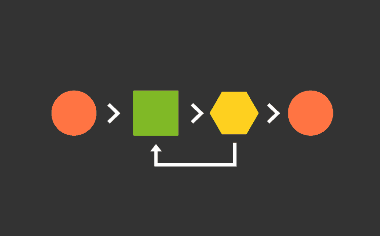

# Algoritmos em JavaScript

## Logo

  

## Sumário

- [Tecnologias Utilizadas](#tecnologias-utilizadas)
- [Status](#status)
- [Descrição](#descrição)
- [Funcionalidades](#funcionalidades)
- [Como Usar](#como-usar)
- [Estrutura do Projeto](#estrutura-do-projeto)
- [Autor](#autor)

## Tecnologias Utilizadas

  

    
  

## Status

## Descrição

Este repositório contém implementações de algoritmos em JavaScript, focados em operações com listas de objetos, especialmente no contexto de livros. A escolha desses algoritmos visa demonstrar diferentes abordagens de ordenação e manipulação de listas.

## Funcionalidades

- `juntaListas`: Função que recebe duas listas como entrada e retorna uma nova lista que é a união das duas, preservando a ordem crescente com base no preço dos elementos.
- `mergeSort`: Implementação do algoritmo de ordenação Merge Sort, que ordena uma lista de objetos (livros) com base no preço.
- `quickSort`: Implementação do algoritmo de ordenação QuickSort, que ordena uma lista de objetos (livros) com base no preço.

## Como Usar

1. Clone o repositório.
2. Navegue até a pasta desejada (e.g., uniaoListas, ordenaListas).
3. Execute o arquivo JavaScript correspondente (e.g., uniaoListas.js, mergeSort.js).

## Estrutura do Projeto

- `uniaoListas`:
  - `uniaoListas.js`: Contém a função `juntaListas`.
- `ordenaListas`:
  - `mergeSort.js`: Implementação do algoritmo de ordenação Merge Sort.
  - `quickSort.js`: Implementação do algoritmo de ordenação QuickSort.
  - `encontraMenores.js`: Contém funções auxiliares para encontrar e trocar elementos menores.

## Autor

Desenvolvido por Diego Franco.
